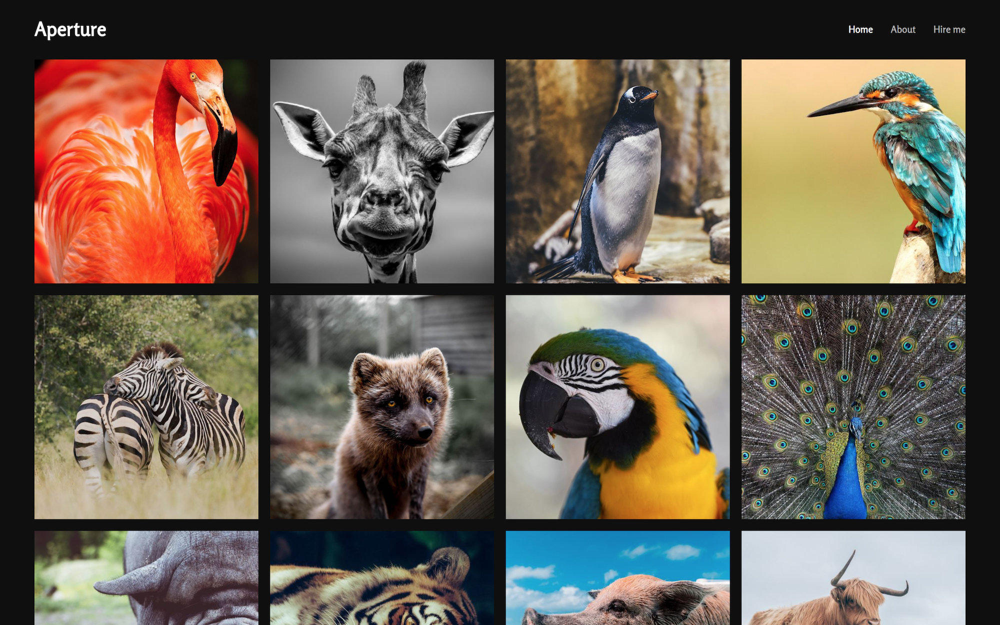

# Aperture

Aperture template for Jekyll. Browse through a [live demo](https://cosmic-hippopotamus.cloudvent.net/).

Aperture was made by [CloudCannon](http://cloudcannon.com/), the Cloud CMS for Jekyll.
Find more templates and themes at [CloudCannon Academy](https://learn.cloudcannon.com/jekyll-templates/).

Learn Jekyll with step-by-step tutorials and videos at [CloudCannon Academy](https://learn.cloudcannon.com/).

## Features

* Photo grid
* Thumbnails
* Captions
* About page
* Contact page

## Setup

1. Add your site and author details in `_config.yml`.
2. Get a workflow going to see your site's output (with [CloudCannon](https://app.cloudcannon.com/) or Jekyll locally).

## Develop

Aperture was built with [Jekyll](http://jekyllrb.com/) version 3.7.2, but should support newer versions as well.

Install the dependencies with [Bundler](http://bundler.io/):

~~~bash
$ bundle install
~~~

Run `jekyll` commands through Bundler to ensure you're using the right versions:

~~~bash
$ bundle exec jekyll serve
~~~

## Editing

Aperture is already optimised for adding, updating and removing photos and navigation in CloudCannon.

### Navigation

* Exposed as a data file to give clients better access.
* Set in the *Data* / *Navigation* section.

### Photo Gallery

* Populated using front matter array in `index.html`.
